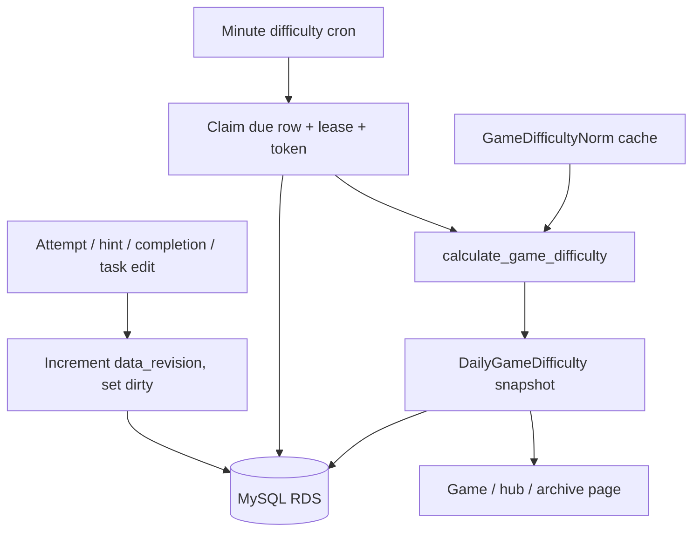

# Daily-game difficulty cache

Status: implemented 2026-08-27.

This document describes how Interoves stores and refreshes the 1–5 star
difficulty badges for the three scheduled daily games (Лесенка / ladder,
Алфавитка / alphabetty, Салатик / salad). It is the source of truth for the
scheduler; the code comments only mark the non-obvious race and locking bits.

## 1. Purpose

Difficulty is an aggregate over every player of one edition: active time,
errors, help, unfinished rate, compared to a same-type historical baseline.
That aggregation is too expensive to run when someone opens a page, and it
gets more expensive as the archive grows.

Pages therefore **only read** a stored snapshot (`DailyGameDifficulty`).
They never call `calculate_game_difficulty()`. If no visible snapshot exists,
the badge is omitted.

A minute cron on Elastic Beanstalk refreshes snapshots in the background.

## 2. Architecture

Production uses **MySQL on RDS**, not PostgreSQL. The scheduler still follows
the same claim design (`SELECT … FOR UPDATE SKIP LOCKED` is supported on
MySQL 8). `flock` on a single EB instance is extra local protection only.



No Celery, Redis queue, SQS, or Lambda is involved. The database row is the
queue.

## 3. Lifecycle of one edition

1. A `GameTaskGroup` for ladder / alphabetty / salad is created (support
   console, admin, or backfill). `ensure_daily_difficulty_row` inserts
   `DailyGameDifficulty` with `data_revision=1`, `calculated_revision=0`,
   `dirty=True`, `refresh_not_before=published_at` (or `now` if unknown).
2. Until `published_at`, the row is not due. Pre-created future editions sit
   quietly.
3. After publish, the next cron tick can claim the row and calculate. Until
   `n >= 5` the public badge stays hidden; the snapshot still exists.
4. A later attempt / hint / letter reveal / completion runs
   `mark_game_difficulty_changed`: cheap `data_revision = data_revision + 1`,
   `dirty=True`. No aggregation in the request.
5. Cron will not calculate again until `refresh_not_before`. That timestamp
   is **throttle**, not a scheduled rebuild of clean games.
6. When the throttle expires and the row is still dirty, cron claims it,
   recalculates, writes the snapshot, and sets the next `refresh_not_before`
   from the cadence table.

## 4. Cadence

Defined in `games/difficulty.py` as `REFRESH_INTERVALS` /
`REFRESH_INTERVAL_OLD`.

| Age since `published_at` | Max refresh frequency |
|---|---|
| < 6 hours | 5 minutes |
| 6–24 hours | 15 minutes |
| 1–3 days | 1 hour |
| 3–7 days | 6 hours |
| 7–30 days | 24 hours |
| > 30 days | 7 days |
| unknown `published_at` | 7 days |

Cadence is the **maximum** frequency for a **dirty** game. A clean historical
edition is not recalculated just because a week passed. If nobody plays it,
it generates no cron work.

If a month-old edition suddenly gets a new player, `data_revision` increases.
When `refresh_not_before` is already in the past, the next tick may claim it
immediately, then throttle at the 7-day interval.

## 5. Revisions

`DailyGameDifficulty` keeps two counters:

- `data_revision` — incremented atomically (`F()` expression) on relevant
  events.
- `calculated_revision` — the revision the last successful snapshot used.

`dirty` is denormalized `data_revision > calculated_revision`, so MySQL can
index due rows (`games_dgd_due_idx` on `(dirty, refresh_not_before)`). MySQL
has no PostgreSQL-style partial index `WHERE dirty`.

Race the counters exist to close:

```text
worker claims revision 10
→ a new attempt commits, data_revision = 11
→ worker writes calculated_revision = 10
→ dirty stays true because data_revision != 10
```

The new attempt is not lost. The next allowed tick recalculates.

## 6. Distributed claim

`games/difficulty_refresh.py` / `claim_due_daily_difficulties`:

1. Short transaction.
2. Select due rows (`dirty`, `refresh_not_before <= now`, lease missing or
   expired), newest `published_at` first, `LIMIT`.
3. `select_for_update(skip_locked=True)` when the backend supports it.
4. Set `refresh_claim_token = uuid4()` and `refresh_claimed_until = now + 5
   minutes` (`REFRESH_CLAIM_LEASE`).
5. Commit. Calculation runs **outside** that transaction so a slow aggregate
   does not hold row locks.

A second `UPDATE … WHERE lease expired` is applied per row so SQLite tests
(and a backend without `SKIP LOCKED`) still cannot double-claim.

`flock` in `scripts/difficulty_cron.sh` only prevents two processes on **one**
machine. Rolling deploys run two instances; they coordinate through MySQL.

## 7. Crash recovery

| Situation | What happens |
|---|---|
| Worker dies after claim | Lease expires (5 minutes). Another instance may claim. Snapshot is unchanged. |
| Calculation raises | Snapshot, revisions, and payload are left alone. `refresh_fail_count` increases, `refresh_last_error` is stored, claim is released, `refresh_not_before` moves by retry backoff: 5 min, 15 min, 1 hour, then cap 6 hours. |
| Stale worker returns after a newer worker wrote | Final `UPDATE` is `WHERE refresh_claim_token = this_worker_token`. Zero rows updated; B's snapshot is kept. |
| Success | `refresh_fail_count = 0`, claim cleared, cadence applied, `dirty` cleared only if `data_revision` is still the claimed revision. |

## 8. Historical norm

`GameDifficultyNorm` stores one cached baseline per game type:

- `typical_time`, `typical_errors`, `typical_help_rate`, `typical_unfinished_rate`
- `version`, `calculated_at`, `payload` (includes per-metric sources)

The minute cron refreshes a type when the cache is missing or older than
`NORM_REFRESH_INTERVAL` (24 hours). Rating a single edition reads this row; it
does **not** re-aggregate the whole archive.

`DailyGameDifficulty.norm_version` records which baseline was used. Changing
the cached typical values does **not** dirty the historical archive. A 4-second
drift in typical time must not rebuild hundreds of old badges.

A real formula or baseline change is a **manual rebuild** (section 10).

## 9. Cron / infrastructure

| Item | Location |
|---|---|
| Command | `python manage.py refresh_daily_difficulty --limit 10` |
| Schedule | every minute, every EB web instance |
| EB config | `.ebextensions/difficulty_cron.config` |
| Script (repo) | `scripts/difficulty_cron.sh` |
| Script (instance) | `/opt/interoves/difficulty_cron.sh` |
| Log | `/var/log/difficulty_cron.log` |
| Telegram cron | `.ebextensions/telegram_cron.config` — **separate** job |

Difficulty refresh is not invoked from `telegram_cron.sh`. A hung Playwright
screenshot must not block ratings; a difficulty exception must not block the
ladder channel post.

`flock` on `/var/lock/difficulty_cron.lock` is local-only.

## 10. Manual operations

Use the project venv (`../venv/interoves_django/bin/python`).

```bash
# One cron tick (also what EB runs)
python manage.py refresh_daily_difficulty --limit 10

# Same, but only one game type
python manage.py refresh_daily_difficulty --game ladder --limit 10
python manage.py refresh_daily_difficulty --game-type salad --limit 5

# Show due rows without claiming
python manage.py refresh_daily_difficulty --dry-run --limit 20

# Rebuild one placement (clears a stale claim first)
python manage.py recalculate_daily_difficulty --placement-id 123

# Rebuild every edition of one type (two-pass: metrics, then ratings)
python manage.py recalculate_daily_difficulty --game ladder

# Rebuild the whole supported archive
python manage.py recalculate_daily_difficulty --all

# Create missing snapshot rows for historical editions
python manage.py backfill_daily_difficulties
python manage.py backfill_daily_difficulties --game alphabetty --dry-run
```

Django admin: `DailyGameDifficulty` is read-only except for the action
«Пересчитать выбранные оценки сложности». `GameDifficultyNorm` is read-only.

## 11. Troubleshooting

**Badge missing on a published game**

- No row: run `backfill_daily_difficulties` or check that `GameTaskGroup`
  save created one (`game_id` must be `ladder` / `alphabetty` / `salad`).
- Row exists but `n < 5`: badge is hidden by design.
- Row exists, `stars` is null: same.

**Stars not updating after new plays**

1. `data_revision` vs `calculated_revision` — if equal, the event did not
   mark the row (unexpected sender? hidden player?).
2. `refresh_not_before` — still in the future means throttle.
3. `refresh_claimed_until` — another worker holds the lease.
4. `refresh_last_error` / `refresh_fail_count` — calculation is failing;
   see `/var/log/difficulty_cron.log`.

**Row retries forever**

Look at `refresh_fail_count` and `refresh_last_error`. Backoff caps at 6
hours; the row stays dirty until a success.

**Snapshot looks too old**

If `dirty` is false, there have been no counted events since the last write.
If `dirty` is true, check the scheduler filters above. Clean games older than
30 days are **not** rebuilt weekly.

## 12. Changing cadence

Edit `REFRESH_INTERVALS` and `REFRESH_INTERVAL_OLD` in `games/difficulty.py`.
Keep the comment that cadence throttles dirty rows only. Already-written
`refresh_not_before` values stay until the next successful calculation; they
are not rewritten globally.

`REFRESH_CLAIM_LEASE`, `REFRESH_RETRY_INTERVALS`, `NORM_REFRESH_INTERVAL`,
and `DUE_REFRESH_LIMIT` live in the same module.

## 13. Changing the formula

Two different operations:

- **Refresh existing snapshot** — the minute cron / `refresh_daily_difficulty`
  recalculates due dirty rows with the current code and the cached norm.
- **Full historical rebuild after a formula change** —
  `recalculate_daily_difficulty --all` (or `--game …`). That two-pass rebuild
  re-observes every edition, refreshes `GameDifficultyNorm`, then re-rates.
  Do this after changing weights, bounds, or how metrics are collected.
  Updating the cached norm alone will not rebuild the archive.
